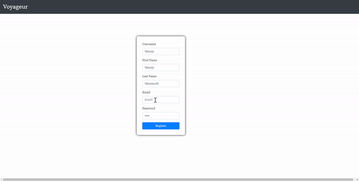
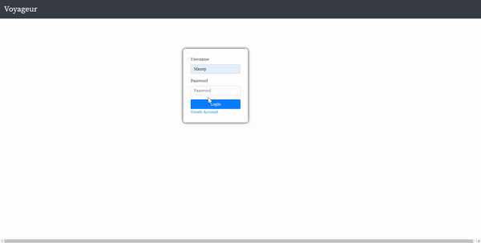
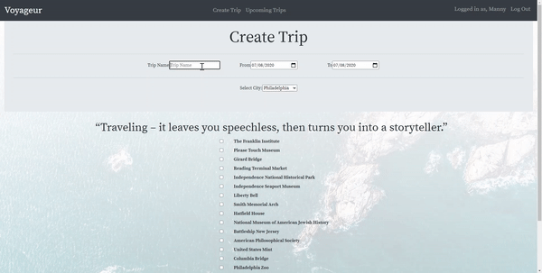

# Voyageur #

Voyageur is an interactive web application where users construct their travel itineraries and locate their routes on the map.  This app helps organize, store, and plan user's travel ideas and search for the most recommended destinations in one place. Voyageur dynamically locates sights selected by the user to create a plan that maximizes the time.  In this application, users create trips by choosing the city and the most recommended sights.  Once the tour is created, the user can remove extra selected sites or can delete the entire trip.  A dynamic map is generated with all the sights located as markers on the map.


## Contents ##
* [Tech Stack](#Tech-Stack)
* [Features](#Features)
* [Installation](#Installation)

## Tech Stack ## 
* Python(Back-end language)
* React JS(Front-end framework)
* Flask(Web framework)
* PostgresQL
* SQLAlchemy
* jQuery
* Jinja
* Google Places API
* JavaScript Map Library
* Bootstrap
* CSS
* HTML

## Features ##
  * Sign up for the App
  
  
  
  * Log in 
  
  
  

  1. To create a trip, the user puts information about the trip and the dates. The user selects the city by clicking on the drop-down box. Here, the flask server makes a Google API call to fetch all the top sights associated with the city. 
  2. React component renders this information where the user can select the sights by clicking on these checkboxes. Once a user clicks on the save trip button, all the information about the trip on this page is then propagated to the parent component and it will post this information to the server.
  
  
  
  
  3. The server stores this information in the PostgreSQL database, a request is being sent to fetch all the stored information about the trips and sights for the user on the Upcoming Page. Maps for each trip are dynamically generated in the React component. Now the react component will make another API call to the JavaScript Map library to put sight markers utilizing Latitude and Longitude coordinates. When a user clicks on the map markers, sight names will be displayed on them.
  4. There are links to delete a trip and sight items for a created trip. If the item is last in the trip, remove item will delete the entir trip as well. 
  
  
  
 ## Installation ##
 
 To run Voyageur on your machine:
 
 Clone this repository:
 
 ```
 https://github.com/divyakulkarni-code/Voyageur
 ```
 
 Create and activate a virtual environment inside your project directory:

  ```
  $virtualenv env --always-copy (for windows)
  (if on MAc: $virtualenv env)
  $ source env/bin/activate
  ```
  
  Install the dependencies:
  
  ```
  $ pip3 install -r requirements.txt
  ```
  
  ### I used Google API for Voyegeur###
  
   * Sign up with the Google API trial Account. 
   * Enable Google Places API, Geocoding, Maps Javascript API
   * Navigate to Credentials Page, create your credentials, and you can find your API key.
   
  ** You do not need to put the key in secrets.sh as long as you secure it. I restricted my key to IP address. You can choose yours.** 
  
Set up the database

```
python3 seed_database.py

or

$createdb trip_itinerary
$python3 -i model.py
db.create_all()
```
Run the server

```
$python3 server.py
```

Navigate to 'localhost:5000/' in your browser to access Voyageur


   
  
  
 
  
  
  
  
  
  
